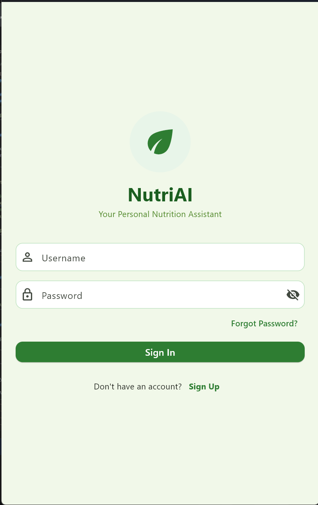
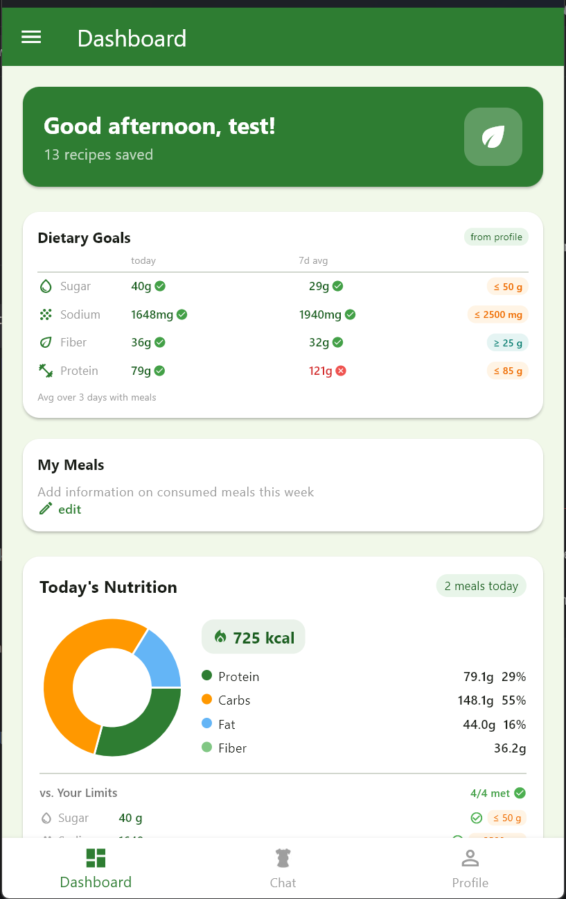
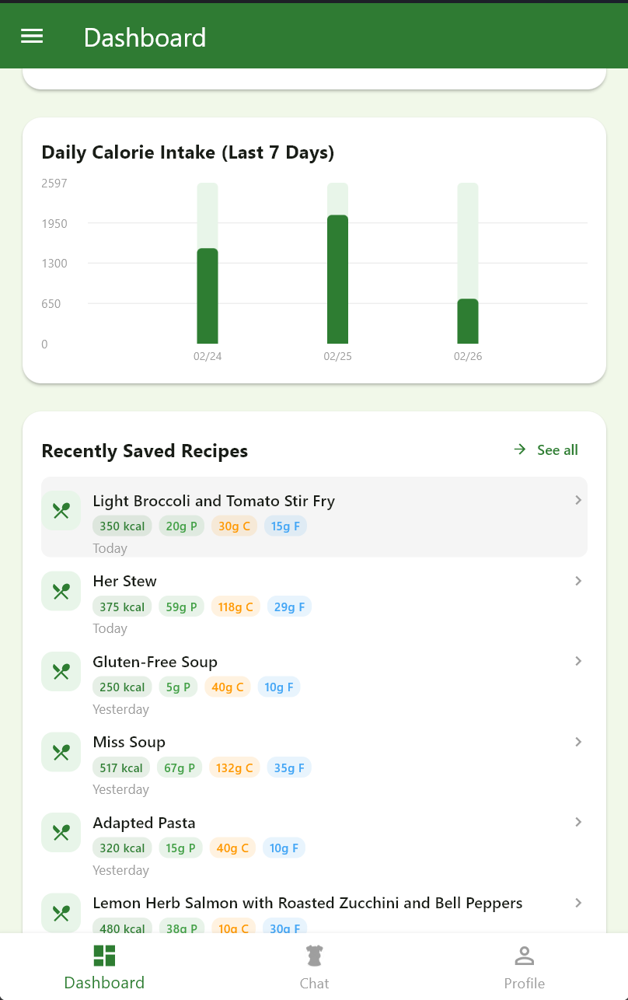
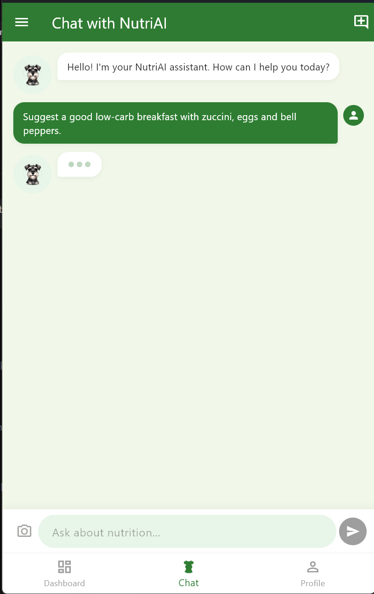
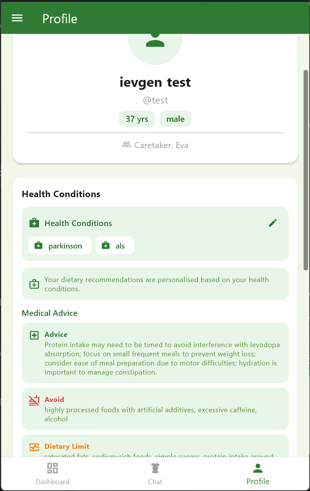

# NutriAI

**AI recipe agent for your personal diet.**

A personalized nutrition and recipe recommendation system powered by LLM, RAG, and computer vision. The system understands user health conditions, dietary restrictions, and daily nutrition budgets. It recommends safe recipes, detects food ingredients from photos, tracks daily nutrition, and holds natural conversations through a chat interface.

---

## Demo

<p align="center">
  
  
  
</p>
<p align="center">
  
  
</p>

A full walkthrough video is available at [`demo_material/nutrition_ai_assistent_app_demo.mp4`](demo_material/nutrition_ai_assistent_app_demo.mp4).

---

## Table of Contents

**About the Project**

1. [Key Features](#key-features)
2. [Tech Stack](#tech-stack)
3. [High-Level Architecture](#high-level-architecture)
4. [Repository Structure](#repository-structure)

**Try It Yourself**

5. [Prerequisites and Setup](#prerequisites-and-setup)
6. [Level 1 -- CLI (easiest)](#level-1--cli-easiest)
7. [Level 2 -- Running Locally with Two Terminals](#level-2--running-locally-with-two-terminals)
8. [Level 3 -- Running with Docker](#level-3--running-with-docker)
9. [Level 4 -- Android APK (advanced)](#level-4--android-apk-advanced)

**Reference**

10. [Usage Overview](#usage-overview)
11. [Data and Vector Store Management](#data-and-vector-store-management)
12. [Testing and Quality](#testing-and-quality)
13. [Roadmap / Future Improvements](#roadmap--future-improvements)
14. [License](#license)

---

# About the Project

## Key Features

- **Live chat for recipe recommendations** -- Conversational agent considers health conditions, preferences, allergies, and dietary restrictions when suggesting recipes.
- **Ingredient extraction from images** -- Upload a photo and a YOLO + Food101 ResNet18 pipeline identifies ingredients, with LLaVA as a fallback.
- **Dashboard** -- Track saved recipes, daily nutritional intake, and dietary goals.
- **Medical RAG** -- Automatic extraction of nutritional advice based on health conditions from medical literature (FAISS + BM25 hybrid retrieval).
- **Recipe RAG** -- Retrieval-augmented recipe search across nutrition and recipe datasets.
- **Safety filter** -- Every recommendation is checked against the user's health profile and nutrition limits before delivery.
- **CLI access** -- Register, log in, query recipes, and enter interactive chat sessions from the terminal.

---

## Tech Stack

| Layer | Technology |
|---|---|
| Backend API | FastAPI 0.109, Uvicorn, Pydantic v2 |
| LLM / Agent | LangChain 0.3, Ollama (llama3.2), Groq, OpenAI (switchable) |
| Embeddings | HuggingFace sentence-transformers (all-mpnet-base-v2 & multi-qa-MiniLM-L6-cos-v1) |
| Vector Search | FAISS (faiss-cpu), BM25 (rank_bm25) |
| Image Detection | YOLOv8 (ultralytics), Food101 ResNet18, OpenCV, LLaVA fallback |
| Database | SQLite (aiosqlite) |
| Auth | JWT (python-jose), bcrypt, passlib |
| Frontend | Flutter 3.x (Web, Android, Windows) |
| CLI | Typer, Rich |
| Document Ingestion | pypdf, unstructured |
| Containerization | Docker, Docker Compose |

---

## High-Level Architecture

```
┌──────────────────────────────────────────────────────────────────┐
│  Flutter App (Web / Android / Windows)                           │
│  Cross-platform client -- REST + WebSocket (port 9000)           │
└──────────────────┬───────────────────────────────────────────────┘
                   │ HTTP / WebSocket
                   │
┌──────────────────▼───────────────────────────────────────────────┐
│  FastAPI Backend  (src/)                                  :9000  │
│  ├─ LangChain agent with 8 tools                                 │
│  ├─ Medical RAG + Recipe RAG  (FAISS + BM25 hybrid)              │
│  ├─ Safety filter, intent parser                                 │
│  └─ SQLite: users, recipes, nutrition, chat history              │
└──────────┬──────────────────────────┬────────────────────────────┘
           │                          │
 ┌─────────▼───────────┐    ┌─────────▼───────────┐
 │  Ollama  :11434     │    │  YOLO Detector      │
 │  • llama3.2 (LLM)   │    │  :8001              │
 │  • llava (fallback) │    │  • YOLOv8 detection │
 │  • embeddings       │    │  • Food101 ResNet18 │
 └─────────────────────┘    │  • Isolated env     │
                            └─────────────────────┘

┌──────────────────────────────────────────┐
│  CLI  (run_cli.py)                       │
│  Same ServiceFactory & agent as the API  │
│  register / login / ask / chat / init    │
└──────────────────────────────────────────┘
```

**Agent tools:** `search_recipes` . `save_recipe` . `show_recipe` . `analyze_image` . `nutrition_status` . `general_chat` . `safety_guard` . `crisis_support`

**Image detection:** YOLO microservice (primary) -> LLaVA via Ollama (fallback when YOLO finds nothing or is unavailable).

---

## Repository Structure

```
nutrition-ai-assistant/
├── src/                        # FastAPI backend (hexagonal architecture)
│   ├── adapters/rest/          #   HTTP routes, WebSocket chat
│   ├── adapters/cli/           #   CLI adapter (Typer + Rich)
│   ├── agent/                  #   LangChain agent + 8 tools
│   ├── application/            #   Services, DTOs, session context
│   ├── domain/                 #   Entities, ports, exceptions
│   ├── infrastructure/         #   RAG, LLM, CNN adapters, SQLite repos
│   ├── rags/                   #   RAG implementations (medical, recipe)
│   ├── pipeline/               #   Pipeline orchestration
│   ├── factory.py              #   Composition root -- all dependency wiring
│   └── settings.py             #   Path constants
├── services/
│   └── yolo_detector/          # YOLO microservice (isolated Python env)
│       ├── detector.py         #   YOLOv8 + Food101 ResNet18 pipeline
│       ├── main.py             #   FastAPI wrapper (POST /detect, GET /health)
│       ├── requirements.txt    #   ultralytics, opencv-headless, torch
│       └── Dockerfile          #   Container definition
├── app/
│   └── nutrition_ai_assistent/ # Flutter cross-platform client
├── data/                       # Demo recipe + nutrition CSVs
├── vector_databases/           # FAISS vector stores
├── db/                         # SQLite database (created at runtime)
├── uploads/                    # Shared image upload directory
├── docs/                       # Architecture guide, CNN docs, analysis
├── demo_material/              # App screenshots and demo video
├── test_functionality/         # Functional test scripts
├── Dockerfile                  # Main API container
├── docker-compose.yml          # Orchestrates API + YOLO + Ollama
├── run_api.py                  # Local dev entry (uvicorn, port 9000)
├── run_cli.py                  # CLI entry point
├── requirements.txt            # Production Python dependencies
└── .env.example                # Environment variable template
```

---

# Try It Yourself

Pick the level that matches your comfort. Each level builds on the setup from the previous one, but you can jump straight to any level if you already have the prerequisites.

| Level | What you get | Time estimate | You need |
|---|---|---|---|
| **1 -- CLI** | Chat with the AI agent in your terminal | ~5 min | Python, Ollama |
| **2 -- Local** | Full app in the browser (Web) | ~10 min | + two terminals |
| **3 -- Docker** | One-command containerized stack | ~10 min | Docker only |
| **4 -- Android APK** | Install on a real phone | ~15 min | + Flutter SDK, device |

---

## Prerequisites and Setup

### Common Prerequisites

| Tool | Version | Needed for |
|---|---|---|
| Python | 3.11+ | Levels 1, 2, 4 |
| Ollama | latest | Levels 1, 2, 4 (local LLMs) |
| Docker + Docker Compose | latest | Level 3 |
| Flutter SDK | 3.x (SDK constraint ^3.9.2) | Level 4 |

### Environment Variables

All levels require a `.env` file. Create it once:

```bash
cp .env.example .env
```

At minimum, edit these:

| Variable | Default | Description |
|---|---|---|
| `JWT_SECRET` | `change-me-in-production` | Secret key for JWT tokens |
| `LLM_PROVIDER` | `ollama` | LLM backend: `ollama`, `groq`, or `openai` |
| `GROQ_API_KEY` | -- | Required when `LLM_PROVIDER=groq` |
| `OPENAI_API_KEY` | -- | Required when `LLM_PROVIDER=openai` |

<details>
<summary>Full environment variable reference</summary>

| Variable | Default | Description |
|---|---|---|
| `JWT_SECRET` | `change-me-in-production` | Secret key for JWT tokens |
| `JWT_EXPIRY_HOURS` | `24` | Token lifetime in hours |
| `LLM_PROVIDER` | `ollama` | LLM backend: `ollama`, `groq`, or `openai` |
| `LLM_MODEL_OLLAMA` | `llama3.2` | Model name when using Ollama |
| `LLM_MODEL_GROQ` | `llama-3.3-70b-versatile` | Model name when using Groq |
| `LLM_MODEL_OPENAI` | `gpt-4.1-mini` | Model name when using OpenAI |
| `GROQ_API_KEY` | -- | Required when `LLM_PROVIDER=groq` |
| `OPENAI_API_KEY` | -- | Required when `LLM_PROVIDER=openai` |
| `OLLAMA_BASE_URL` | `http://localhost:11434/` | Ollama server URL |
| `EMBEDDING_MODEL` | `sentence-transformers/all-mpnet-base-v2` | HuggingFace embedding model |
| `DB_PATH` | `users.db` | SQLite database path |
| `CNN_DETECTOR_TYPE` | `yolo_with_fallback` | `yolo_with_fallback`, `yolo_only`, or `llava_only` |
| `YOLO_SERVICE_URL` | `http://localhost:8001` | YOLO microservice URL |
| `CNN_MODEL_PATH` | `llava` | LLaVA model name for fallback |

</details>

### Backend Environment (Levels 1, 2, 4)

```bash
# From project root
python -m venv .venv

# Windows
.venv\Scripts\activate
# macOS / Linux
source .venv/bin/activate

pip install -r requirements.txt
```

### Start Ollama (Levels 1, 2, 4)

```bash
ollama serve
ollama pull llama3.2
ollama pull llava
```

---

## Level 1 -- CLI (easiest)

**What:** Talk to the AI agent directly in your terminal. No browser, no Flutter, no Docker.

**Prerequisites:** Python venv + Ollama running (see above).

```bash
# From project root, with main venv activated
python run_cli.py --help
```

**Quick start:**

```bash
python run_cli.py register
python run_cli.py login
python run_cli.py ask "healthy dinner with chicken"
python run_cli.py chat
```

Available commands:

| Command | Description |
|---|---|
| `register` | Create a new account |
| `login` | Sign in (saves session to `~/.nutrition-ai/session.json`) |
| `logout` | Clear stored credentials |
| `whoami` | Show the currently logged-in user |
| `profile` | Display health profile and medical advice |
| `ask "query"` | One-shot recipe/nutrition query |
| `chat` | Interactive chat session |
| `init` | Build/rebuild RAG vector stores |

---

## Level 2 -- Running Locally with Two Terminals

**What:** Full application running in your browser with the Flutter web app, backed by the FastAPI server and YOLO detector.

**Prerequisites:** Everything from Level 1, plus the YOLO detector environment and Flutter SDK.

### Terminal 1 -- YOLO Detector

The YOLO service requires its own virtual environment due to conflicting dependency versions.

```bash
cd services/yolo_detector
python -m venv .venv

# Windows
.venv\Scripts\activate
# macOS / Linux
source .venv/bin/activate

pip install -r requirements.txt
uvicorn main:app --port 8001
```

Place model weights before running:
- `services/yolo_detector/models/food101_resnet18_best.pth` (custom trained; required)
- `yolov8n.pt` is auto-downloaded by ultralytics on first run

Verify: `curl http://localhost:8001/health`

### Terminal 2 -- FastAPI Backend

```bash
# From project root, activate the main venv
.venv\Scripts\activate          # Windows
# source .venv/bin/activate     # macOS / Linux

python run_api.py
```

The API starts on `http://localhost:9000`. Verify: `curl http://localhost:9000/health`

### Run the Flutter Web App

```bash
cd app/nutrition_ai_assistent
flutter pub get
flutter run -d chrome
```

The app connects to `http://localhost:9000` by default. You can also run as a Windows desktop app:

```bash
flutter run -d windows
```

---

## Level 3 -- Running with Docker

**What:** One command spins up the entire backend stack (API + YOLO + Ollama) in containers. Connect with the Flutter web app or just use the API directly.

**Prerequisites:** Docker and Docker Compose installed. No Python or Ollama installation needed on the host.

### 1. Prepare

```bash
cp .env.example .env
# Edit .env -- at minimum set JWT_SECRET and any API keys needed
```

Place YOLO model weights in `services/yolo_detector/models/food101_resnet18_best.pth`.

### 2. Build and start

```bash
docker-compose up --build
```

This starts:

| Container | Port | Description |
|---|---|---|
| `nutriai-api` | 8000 | FastAPI backend |
| `nutriai-yolo` | 8001 | YOLO detection microservice |
| `nutriai-ollama` | 11434 | Ollama LLM server |

### 3. Pull Ollama models (first run only)

```bash
docker exec -it nutriai-ollama ollama pull llama3.2
docker exec -it nutriai-ollama ollama pull llava
```

### 4. Verify

```bash
curl http://localhost:8000/health    # -> {"status": "ok", "version": "0.2.0"}
curl http://localhost:8001/health    # -> {"status": "ok", "model_loaded": true}
```

### 5. Connect the Flutter web app (optional)

```bash
cd app/nutrition_ai_assistent
flutter pub get
flutter run -d chrome --dart-define=API_BASE_URL=http://localhost:8000
```

### 6. Stop

```bash
docker-compose down
```

### Deployment Notes

- The Docker API runs on port **8000** (Dockerfile CMD). The local dev entry (`run_api.py`) uses port **9000** with hot-reload.
- GPU support for Ollama is commented out in `docker-compose.yml` -- uncomment the `deploy.resources` block if an NVIDIA GPU is available.
- Data directories (`data/`, `data_test/`, `vector_databases/`) are mounted read-only. The `db/` and `uploads/` directories are writable bind mounts.
- Service URLs between containers use Docker internal DNS (`http://ollama:11434/`, `http://yolo-detector:8001`), set automatically via environment in `docker-compose.yml`.

---

## Level 4 -- Android APK (advanced)

**What:** Build an APK, install it on a real Android phone, and chat with the AI agent from your device.

**Prerequisites:** Everything from Level 2 running (backend + YOLO), plus Flutter SDK and a connected Android device or emulator.

### 1. Make sure the backend is reachable from the phone

Your phone must be able to reach the machine running the FastAPI backend. Options:

- **Same Wi-Fi network:** Use your machine's LAN IP (e.g., `192.168.1.x`).
- **Public IP / port forwarding:** Use your public IP.

### 2. Build the APK

```bash
cd app/nutrition_ai_assistent
flutter pub get
flutter build apk --dart-define=API_BASE_URL=http://<YOUR_IP>:9000
```

The APK is generated at `build/app/outputs/flutter-apk/app-release.apk`.

### 3. Install on device

Transfer the APK to your phone and install it, or use:

```bash
flutter install
```

### Alternative: Run directly on a connected device

```bash
# Android emulator
flutter run --dart-define=API_BASE_URL=http://10.0.2.2:9000

# Physical device over USB (same LAN)
flutter run --dart-define=API_BASE_URL=http://<YOUR_LAN_IP>:9000
```

A `dart_defines/local.json.example` template is provided for reference.

---

# Reference

## Usage Overview

### Chat-based Recipe Recommendations

1. Register and log in (via Flutter app or CLI).
2. Set up your health profile -- conditions, allergies, dietary restrictions, daily nutrition goals.
3. Ask for recipe suggestions in natural language.
4. The agent parses your intent, queries the Recipe RAG and Medical RAG, applies the safety filter against your profile, and returns tailored recommendations.
5. Save recipes you like; the dashboard tracks your daily nutritional intake.

### Image-based Ingredient Extraction

1. Upload a food photo through the Flutter app.
2. The image is sent to the YOLO microservice, which runs YOLOv8 object detection followed by Food101 ResNet18 classification.
3. If YOLO returns no results (or is unavailable), the system falls back to LLaVA via Ollama for vision-based ingredient extraction.
4. Detected ingredients are returned to the agent, which can then suggest recipes using those ingredients.

### Example Queries

```
I have type 2 diabetes and want to keep my meal low in refined carbs.
I currently have salmon, zucchini, bell peppers, lemon, Greek yogurt,
and almonds. Can you suggest a creative recipe?
```

---

## Data and Vector Store Management

- **Demo data included:** Small CSV datasets in `data/` (cleaned recipes, nutrition facts, healthy meals) are included for demonstration.
- **Private medical data not included:** Medical research PDFs used by the Medical RAG are private and not committed to this repository.
- **Vector stores:** Pre-built FAISS indexes live in `vector_databases/`. They can be rebuilt or extended:
  - Via CLI: `python run_cli.py init`
  - Via the functional test scripts in `test_functionality/` (e.g., `test_add_data_to_medical_vector_db.py`, `test_add_data_to_recipe_vector_db.py`, `test_recreate_vector_db.py`)
- The system supports dynamically updating or extending vector stores with new data without restarting the application.

---

## Testing and Quality

Functional test scripts are located in `test_functionality/`:

| Script | Purpose |
|---|---|
| `test_agent.py` | End-to-end agent conversation test |
| `test_rag_medical.py` | Medical RAG retrieval validation |
| `test_rag_recipe.py` | Recipe RAG retrieval validation |
| `test_safety_filter.py` | Safety filter logic |
| `test_intent_parser.py` | Intent classification |
| `test_search_recipes_tool.py` | Recipe search tool |
| `test_add_data_to_vector_db.py` | Vector store data ingestion |
| `test_add_data_to_medical_vector_db.py` | Medical vector store ingestion |
| `test_add_data_to_recipe_vector_db.py` | Recipe vector store ingestion |
| `test_recreate_vector_db.py` | Full vector store rebuild |
| `test_add_dummy_user.py` | User creation test |

Run individual scripts:

```bash
python test_functionality/test_agent.py
```

---

## Roadmap / Future Improvements

- Smarter per-meal nutrition distribution (currently uses a 1/3 daily budget heuristic).
- Graduated severity levels for nutrition limit warnings.
- Timezone-aware timestamp handling improvements.
- Tighten CORS `allowed_origins` for production deployment.
- GPU acceleration configuration for Ollama in Docker.
- Add unit tests with coverage reporting.
- CI/CD pipeline automation.

---

## License

This project is licensed under the [MIT License](LICENSE).
